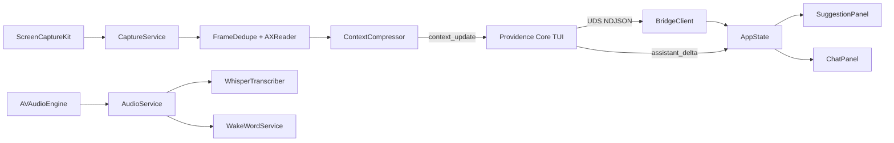

# Providence Overlay

**Ambient AI chat panel for macOS. Watches your screen, listens for wake words, streams context into the Providence Core conversation.**

## Overview

Providence Overlay is a transparent floating chat panel that runs as a menu bar companion to [Providence Core](https://github.com/gravitrone/providence-core). It captures screen + audio, classifies what you are doing, and feeds that context into your assistant's next turn. **Think of it as a heads-up display for an LLM session**, not a separate chatbot.

***One shared session, two surfaces: the terminal you type in and the ghost panel watching over your shoulder.***

> For developers running Providence Core who want their assistant to see what they are doing without screenshot tools, without context switching, without re-explaining the codebase every turn.

## Quickstart

```bash
git clone https://github.com/gravitrone/providence-overlay.git
cd providence-overlay
make install
```

Add to `~/.providence/config.toml` (Providence Core side):

```toml
[overlay]
enable = true
auto_start = true
spawn = false
ui_mode = "chat"
chat_history_limit = 50
chat_alpha = 0.92
daily_token_budget = 50000
```

Launch Providence Core, then in a fresh shell:

```bash
open -n -a ~/Applications/"Providence Overlay.app" \
  --args --socket=$HOME/.providence/run/overlay.sock
```

macOS will prompt for Screen Recording, Accessibility, and Microphone permissions on first run. Grant each when asked.

## Why

Most AI assistants are stateless between turns. You screenshot, paste, explain, repeat. Every context switch is friction and every missed detail is a worse answer. Tools that try to solve this (Cluely, Rewind, Granola) either spam the model with every frame or hide behind private APIs that Apple breaks. Providence Overlay uses **documented macOS APIs**, respects TCC, and gates emissions aggressively so the token cost stays bounded.

**Dedupe first, emit only on change, stop at the daily budget.** That is the whole philosophy.

## Features

- **Two rendering modes** - Ghost panel fades in on suggestions and auto-hides. Chat panel stays persistent with scrollable history and a text input. Toggle between them via config or the menu bar.
- **ScreenCaptureKit pipeline** - Adaptive frame rate (0.2 fps idle, 1 fps active, 2 fps in meetings, 5 fps burst). dHash deduplication skips identical frames.
- **Local transcription** - WhisperKit tiny.en runs on the Neural Engine. "Hey Providence" wake word via on-device SFSpeechRecognizer. Cmd+Option+Space for push-to-talk.
- **Accessibility-first context** - Reads the focused window's AX tree for structured text instead of relying on OCR. Falls back to Vision framework for apps without AX support.
- **Stealth by default** - `sharingType = .none` on all panels and an auto-hide heuristic when Zoom, Teams, Meet, Chime, or FaceTime is frontmost.
- **Bounded cost** - Jaccard-similarity transcript gating, 5-second heartbeat minimum, per-day token budget with automatic shutoff.
- **Menu bar control** - Toggle UI mode, pause capture, add apps to the exclusion list, view session token spend.

## Architecture



Two Swift Package Manager targets. `ProvidenceOverlay` is the executable with AppKit, SwiftUI, and all framework integrations. `ProvidenceOverlayCore` is a pure-logic library containing the activity classifier, perceptual hash, transcript similarity, and Codable models.

Context reaches the model via `<system-reminder origin="overlay">` blocks that Providence Core prepends to the next user turn. See the Providence Core repository for the TUI-side implementation.

## Hotkeys

- `Cmd+Shift+C` - Toggle chat panel visibility
- `Cmd+Shift+P` - Toggle ghost panel interactivity (click-through vs. clickable)
- `Cmd+Option+Space` - Push-to-talk, starts a 10-second recording window
- `"Hey Providence"` - Wake word (always listening when audio capture is active)

## Development

```bash
make build     # swift build -c release + ad-hoc codesign
make test      # swift test
make app       # wrap into Providence Overlay.app bundle
make install   # copy bundle to ~/Applications + shim at ~/.providence/bin
make clean     # remove .build and build/
```

Targets macOS 14.2+. Tests require `DEVELOPER_DIR=/Applications/Xcode.app/Contents/Developer` when run outside Xcode. WhisperKit downloads the tiny.en model on first launch (~80 MB).

## Known Limitations

- System audio tap is stubbed. Microphone-only transcription in meetings for now.
- Wake word uses SFSpeechRecognizer instead of Porcupine. English-only, on-device.
- Chat history is in-memory. SQLite persistence is planned.
- On macOS 15+, `sharingType = .none` is ignored by ScreenCaptureKit. The auto-hide heuristic covers that gap for known screen-share apps.

## Contributing

Pull requests welcome. For substantial changes, open an issue first to discuss. Follow the conventions in [CLAUDE.md](./CLAUDE.md).

## Legal

Providence Overlay uses documented macOS APIs and respects the system permission model. It does not evade Transparency, Consent, and Control. Users grant Screen Recording, Accessibility, and Microphone permissions explicitly through macOS System Settings.

## License

[MIT](LICENSE)
